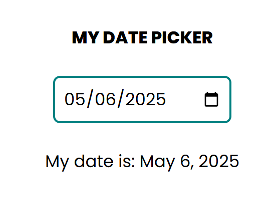

#   📅 date_time
A simple React application built with Create React App (CRA) that allows users to select a date and view it in a friendly, localized format using `moment.js`.

## 🚀 Features

- Pick a date using an HTML date input
- Display selected date in readable format (e.g., May 6, 2025)
- Live update when date changes
- Uses `moment.js` for formatting

## 🖼️ Preview
 <!-- Replace with actual screenshot if available -->

## 🛠️ Built With
- [React](https://reactjs.org/)
- [Moment.js](https://momentjs.com/)
- [Create React App](https://create-react-app.dev/)

<!-- ## 📁 Project Structure -->

## 🧑‍💻 Getting Started
### 1. Clone the repository
```bash
git clone https://github.com/thanhphucnguyen-dev/react-cra-date-time.git
cd react-cra-date-time
```
### 2. Install dependencies
```bash
npm install
```
### 3. Run the application
```bash
npm start
```
Open http://localhost:3000 to view it in the browser.

## 📝 License
This project is licensed under the MIT License - see the [LICENSE.md](LICENSE.md) file for details.

## 📄 Contact
If you have any questions or suggestions, feel free to reach out to me at [thanhphucnguyen@gmail.com](mailto:thanhphucnguyen@gmail.com).  
